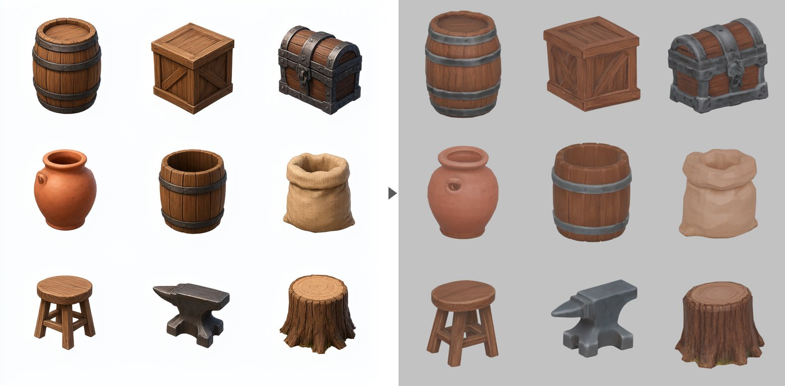

# Prop sheets: many props from one image, in one run



A **prop sheet** is one image holding a grid of separate props: barrels, crates, a chest.
Pixal3D turns the whole sheet into 3D in a single run, and two scripts take it apart into
separate, upright, named props with game-ready levels of detail.

Nine props took 14 minutes on an M5 MacBook with 16 GB, under two minutes a prop. A
single character took about 18 on the same machine.

It is for **props**: things that stand on their own and read from any side. Characters
want the detail of a run to themselves.

## 1. Make the sheet

Use **Generate Image** in the viewer, or bring your own picture. This prompt made the
sheet above (Qwen-Image, default settings, 768x768, about 3 minutes on the same Mac):

```text
A 3x3 grid of nine separate medieval fantasy game props, evenly spaced with generous
empty space between them, each one isolated and not touching any other: a wooden
barrel, a wooden crate, an iron-bound treasure chest, a clay pot, a wooden bucket, a
burlap grain sack, a small wooden stool, an iron anvil, a tree stump. All props at a
similar size, all shown from the same slightly elevated three-quarter view, stylized
hand-painted game asset style, soft even studio lighting, plain white background, no
ground shadows, no text, no labels, no grid lines, no borders
```

What matters in it:

- **Space between props.** Props that touch or overlap in the picture are split as one.
- **Similar sizes.** Pixal3D drops parts under 3% of the largest one as crumbs, so a
  much smaller prop can be dropped with them.
- **A slight view from above is fine, and better.** Pixal3D sees the tops and models
  them. The split step undoes the tilt this causes (see step 3). An eye-level prompt was
  tried: tops it could not see came back invented, and less level (a stool seat 9.4
  degrees off, against 2.2).

Qwen-Image is **non-commercial**, and props made from its pictures inherit that. The
pipeline files them under `research_only`. Bring your own image and that does not apply.

## 2. Turn it into 3D

Pixal3D, default settings:

```bash
python scripts/pixal3d_generate.py sheet.png output/props/sheet.glb --res 1024
```

Keep the default field of view (20 degrees). A near-orthographic 5.7 degrees was tried,
to match how image models draw: the tilt came out more even across the grid, but box
corners came out less square (up to 5.3 degrees off, against 2.7). Neither helped
overall.

## 3. Split it into props

```bash
blender -b --factory-startup -P scripts/blender_split_props.py -- \
    output/props/sheet.glb output/props/split \
    --names barrel crate chest clay_pot bucket grain_sack stool anvil tree_stump
```

Names follow reading order: top row first, left to right. Out come `props.blend`
(everything lined up), one GLB per prop with its origin at the bottom centre, and
`props.json`, a record of what was done to each prop. It takes seconds.

**Why the props need standing up.** Pixal3D's camera is level, and the sheet is drawn from
a little above, so Pixal3D tips each prop back to show its top to a level camera: 22 to
34 degrees on this sheet. That is a rotation, not a distortion. Once undone, tops and
bases sat within 3.3 degrees of level, box corners within 2.7 degrees of square, and
round props measured as deep as they are wide (0.97 to 1.03).

**Why some props get turned.** A crate drawn corner-on comes back rotated 41 degrees
about the vertical. It reads as warped until it is squared up. Box-like props are
turned to face the front. Round and soft ones are left alone, since turning them would
swing their painted front away.

**Check the ties.** A box drawn almost exactly corner-on is a coin toss between its
front and its side. The script flags any turn near 45 degrees. On this sheet the chest
came out with its lock facing sideways, and `--turn chest=90` fixed it.

## 4. Finish each prop

```bash
python scripts/finish_props.py output/props/split output/props/finished
```

Each prop gets three levels of detail (LODs), lighter copies a game swaps in with
distance: 5,000, 2,500 and 1,000 triangles by default (`--lods`). Each has its own
1024 texture and a normal map, a texture that carries the surface relief the triangles
no longer have. The nine props took 2 minutes.

**Every LOD is baked from the original.** Simplifying LOD0 down to 1,000 triangles with
meshoptimizer stretched the texture across its seams, and the barrel's iron hoops came
out blotched. A normal map re-baked for that mesh did not help. Re-baking from the
original came out clean on all nine. The cost is one texture per LOD instead of one
shared.

**Then [gltfpack](https://github.com/zeux/meshoptimizer), for size.** When it is on PATH
(or passed with `--gltfpack`), each LOD also gets a compressed `.web.glb`, with the mesh
compressed and textures in WebP. The chest's LOD0 went from 2.1 MB to 282 KB. Those
files use `EXT_meshopt_compression` and `EXT_texture_webp`: three.js reads both, but
check your engine. Use a native release build of gltfpack, since the npm build cannot
write WebP. Both kinds of file pass the Khronos glTF validator with no errors and no
warnings.

| Prop | LOD0 | LOD1 | LOD2 |
|---|---|---|---|
| barrel | 425 KB | 387 KB | 327 KB |
| crate | 239 KB | 227 KB | 198 KB |
| chest | 282 KB | 270 KB | 262 KB |
| anvil | 139 KB | 133 KB | 123 KB |

## Limits

- **Some bend stays.** After standing up and squaring, what is left is 2 to 5 degrees,
  measured. It comes from how the sheet was drawn, and the field-of-view test above did
  not remove it.
- **Less detail per prop** than a run of its own, since the sheet shares one run's
  resolution between all of them.
- **Metal looks flatter.** The finish bakes colour and relief only. Metallic and
  roughness are flat values (`--metallic`, `--roughness`), so the iron reads a little
  lighter than the original.
- **The front of a round prop is wherever it was drawn.** Nothing turns it.
